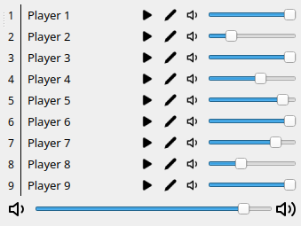
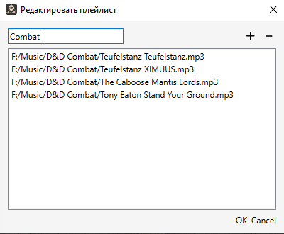
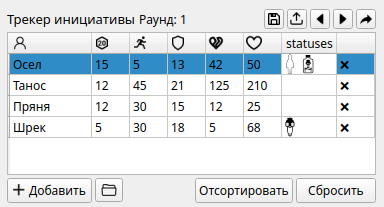
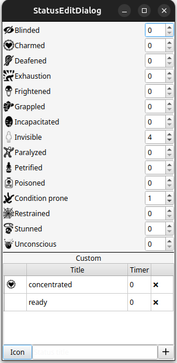
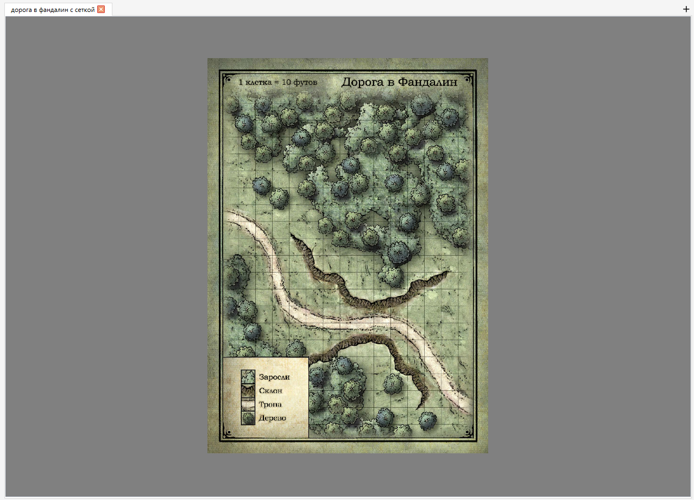
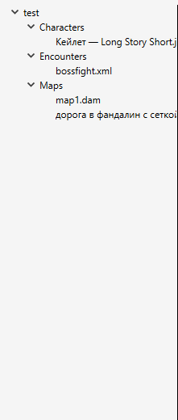
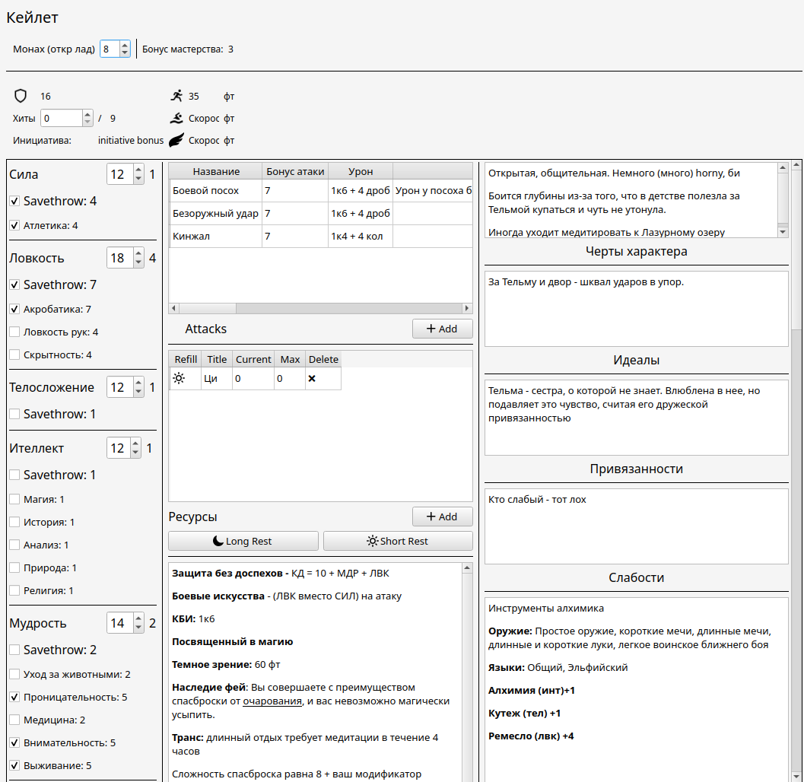
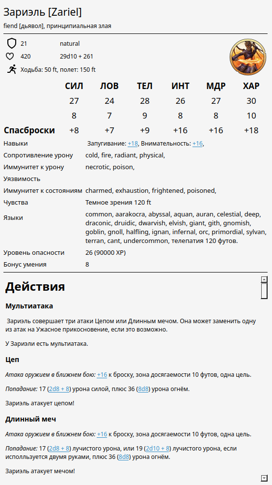
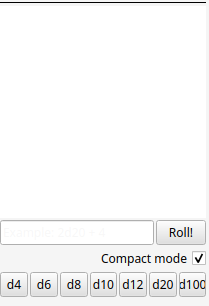

# DM Assist 🎲

**Инструмент для Мастеров (DM/GM) настольных ролевых игр**

**DM Assist** — это современное, интуитивно понятное приложение, созданное, чтобы сделать проведение игр проще и увлекательнее. Проект начинался как удобный музыкальный плеер для смены треков в один клик, но вырос в полноценную систему для управления музыкой, боем, картами и кампаниями.

> 🚀 **Актуальная версия:** v1.4.1 (последний релиз — 11 марта 2026 г.)

---

## 📚 Оглавление

- [Основные возможности](#-основные-возможности)
- [Поддерживаемые системы](#-поддерживаемые-игровые-системы)
- [Установка](#-установка)
- [Быстрый старт](#-быстрый-старт-туториал)
- [Планируемые функции](#-планируемые-функции)
- [Известные проблемы](#-известные-проблемы)
- [Поддержка проекта](#-поддержка-проекта)
- [Благодарности](#-благодарности)

---

## ✨ Основные возможности

| Модуль                        | Описание                                                                                                                                                    |
|-------------------------------|-------------------------------------------------------------------------------------------------------------------------------------------------------------|
| 🎵 **Музыка**                 | Многоканальный плеер с независимой громкостью, плейлистами и горячими клавишами (`Ctrl + номер_плейлиста`).                                                 |
| ⚔️ **Трекер инициативы**      | Управление боем: хиты, AC, статусы, сортировка, совместный доступ для игроков и арифметика в полях (например `10+5-2`).                                     |
| 🗺️ **Карта с инструментами** | Туман войны, динамическое освещение, линейка (с учетом высот!), сетка, фигуры заклинаний, рисование и токены.                                               |
| 📁 **Кампании**               | Всё в одном месте: карты, персонажи, энкаунтеры и плейлисты. Просто откройте папку кампании и продолжайте игру.                                             |
| 📄 **Редактор персонажей**    | Совместимость с [LSS](https://longstoryshort.app/), автоматический расчет бонусов, ресурсы (заклинания/ячейки), заметки с форматированием (`Ctrl+B/I/U`).   |
| 🎲 **Виджет бросков**         | Поддержка нотации `ndX+Y` (на русском и английском), режим группировки кубов, интеграция с листом персонажа.                                                |
| 🌍 **Совместный доступ**      | Отдельные окна для игроков с трекером и картой (синхронизация с мастером).                                                                                  |

## 🎮 Поддерживаемые игровые системы

Приложение (в частности бестиарий и листы персонажей) заточено под **D&D 5e**, но гибкие инструменты (статусы, карта, броски) позволяют использовать его для большинства TTRPG.

---

## 💻 Установка

**Поддерживаемые ОС:** Windows 10/11, Linux (собрано под Ubuntu).

1. Перейдите на [страницу релизов](https://github.com/Technohamster-py/dm-assist/releases).
2. Скачайте последнюю стабильную версию:
  - Для Windows: `.exe` установщик.
  - Для Linux: `.tar.gz` или `zip` архив.
3. Установите скачанный фал:
  - **Windows:** запустите установщик и следуйте инструкциям.
  - **Linux:** распакуйте архив и запустите исполняемый файл `DM-assist`.

---

## 🚀 Быстрый старт (Туториал)

### 🎛️ Настройки (`Ctrl+Alt+S` или `Кампания → Настройки`)

**Общие:**
- **Язык:** русский / английский (можно [добавить свою локализацию](https://github.com/Technohamster-py/dm-assist/wiki/Loacalization)).
- **Аудио выход:** выберите устройство. Используйте виртуальный кабель для трансляции музыки в Discord.
- **Проверка обновлений** при старте.
- **Действие при старте:** выберите, будет ли открываться пустое окно, последняя кампания или список последних кампаний 

**Внешний вид:**
- **Тема:** можно выбрать из предустановленных или загрузить свою `.xml` тему.
- **Стиль:** можно так же добавить собственные Qss фалы стилей. [Подробнее](https://github.com/Technohamster-py/AdaptiveThemeLib)
> Не рекомендуется использовать стиль windows / windows 11 в связке с темной темой из-за некорректной обработки цветов

**Трекер инициативы:**
- Настройте, какие поля видны игрокам (совместный доступ).
- Выберите формат отображения здоровья игрокам
- Включите автоматические броски и автоматическую сортировку.
- Настройте цвет подсветки активного персонажа или оставьте предустановленный темой

**Карта**
- Настройте отображение токенов
- Настройте прозрачность и цвет тумана
- Настройте прозрачность текстур
- Определите размер одной клетки сетки по-умолчанию
- Решите, нужно ли автоматически открывать последние карты при загрузке кампании

**Горячие клавиши:** настройте клавиши для инструментов карты.

### 🎵 Музыка

- **Запуск:** кнопка ▶️ или `Ctrl + номер_плейлиста`.
- **Громкость:** отдельно под каждым плейлистом + общий мастер-слайдер.
- **Редактирование плейлиста:** кнопка ✏️ — добавляйте, удаляйте, меняйте порядок треков. Файлы копируются в рабочую папку.

### ⚔️ Трекер инициативы

- **Столбцы:** инициатива, скорость, AC, текущее/максимальное HP, статусы.
- **Ввод HP:** можно писать выражения `10+5-2` — вычислятся автоматически.
- **Управление:** `PageUp` / `PageDown` для смены активного персонажа, **Sort** для сортировки, **Add** для добавления.
- **Статусы:** двойной клик по ячейке. Есть стандартные статусы D&D и свои (с иконками SVG).

- **Совместный доступ:** кнопка «Поделиться» — откроется окно для игроков с настраиваемыми полями и режимом отображения HP (цифры / статус / прогресс-бар).

### 🗺️ Карта и инструменты

- **Открыть карту:** `Кампания → Добавить → карта` или кнопка `+` на вкладках. Форматы: `JPG, PNG, BMP, DAM`.
- **Навигация:** ЛКМ (без инструмента) или СКМ — перемещение, колесо — зум.
- **Инструменты** (деактивация — `Esc`, удаление элементов `ПКМ`):

| Инструмент          | Действие                                                                                           |
|---------------------|----------------------------------------------------------------------------------------------------|
| 📏 **Линейка**      | Калибровка (ПКМ → задать отрезок и его длину), затем измерение расстояний с учетом высот.          |
| 💡 **Свет**         | Добавляйте источники с цветом и радиусом. Опция «обновлять туман» автоматически открывает область. |
| 🔲 **Формы**        | Круги, линии, квадраты, треугольники (как заклинания в D&D). Рисуются двумя кликами.               |
| ✏️ **Кисть**        | Свободное рисование с цветом и прозрачностью.                                                      |
| ✂️ **Лассо**        | Замкнутые контуры произвольной формы.                                                              |
| 🗻 **Карта высот**  | Области с высотой от -100 до 100 (градиент синий→красный). Влияет на измерения линейки.            |
| 🔲 **Сетка**        | Квадратная или шестиугольная, с настраиваемым размером ячейки.                                     |

- **Совместный доступ:** ПКМ по вкладке карты → «поделиться». Окно игрока синхронизируется с вашими действиями.

> Карта автоматически сохраняется в формате `dam` при закрытии если была открыта в рамках кампейна. Так же можно вручную сохранить карту, нажав ПКМ по вкладке карты и выбрав пункт сохранить

### 📁 Кампании

**Создать:** `Кампания → Новая` (`Ctrl+N`) → указать имя и пустую папку.  
**Открыть:** `Кампания → Открыть` (`Ctrl+O`) → выбрать папку с `campaign.json`.

После открытия:
- Слева появляется дерево кампании (персонажи, карты, энкаунтеры, плейлисты).
- Кнопки у элементов: добавить в энкаунтер, открыть редактор, открыть карту.
- **Токены:** перетащите персонажа из дерева на карту. Изображения берите из папки `Tokens` (можно заменить вручную).
- **Перезагрузка** кампании: `Кампания → Перезагрузить с диска` (после добавления файлов вручную).

### 📄 Редактор персонажа

- Открывается из дерева кампании (кнопка ✏️).
- Совместим с форматом LSS (не обратно — персонаж из DM Assist может не открыться на LSS).
- Характеристики, бонусы атак и урона рассчитываются автоматически.
- **Ресурсы** (ячейки заклинаний и т.п.): таблица с режимом восстановления (короткий/долгий отдых).
- **Кнопки отдыха** восстанавливают ресурсы согласно настройкам.
- **Форматирование текста** в заметках: `Ctrl+B` (жирный), `Ctrl+I` (курсив), `Ctrl+U` (подчеркнутый).

### 📖 Бестиарий

Открывает статлисты монстров в формате **FVTT11** и **FVTT12** (можно скачать, например, с [TTG Club](https://ttg.club/)).
> ⚠️ Информация на сайте TTG может отличаться от файла.

### 🎲 Виджет бросков

- Поддерживается стандартная нотация: `2d6+4`, `1к20+5-1d4`.
- Можно использовать символ `д` и `к` вместо `d`.
- **Компактный режим:** группирует одинаковые дайсы (`1d4+3d4 → 4d4`).
- **Интеграция с персонажем:** клик по **названию** характеристики, навыка, бонусу атаки/урона — бросок автоматически отправляется в виджет.

---

## 📅 Планируемые функции

### D&D 5e
- [ ] Хранилище персонажей с быстрым поднятием уровня (выбор улучшений, как в BG3).
- [ ] Поддержка мультиклассов.

### Другие системы
В планах — специальные режимы для:
- [ ] Call of Cthulhu
- [ ] Cyberpunk (RED, 2020)
- [ ] World of Darkness (MtA, VtM и др.)
- [ ] Pathfinder / Starfinder

---

## 💖 Поддержка проекта

Вы можете поддержать разработку добровольным пожертвованием. Это никак не влияет на функционал, но очень помогает проекту.  
[Ссылка для поддержки](https://technohamster.taplink.ws/)

---

## 🙏 Благодарности

- **TTG Club** — за иконки, использованные в таблице инициативы.
- Всем контрибьюторам и пользователям, кто сообщает об ошибках и предлагает идеи.

---

**Happy GMing! 🐉**